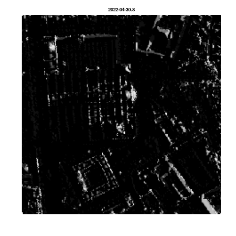

<!-- README.md is generated from README.Rmd. Please edit that file -->

# CityShadeMapper

<!-- badges: start -->

[](https://github.com/Pakillo/CityShadeMapper/actions/workflows/R-CMD-check.yaml)
[](https://app.codecov.io/gh/Pakillo/CityShadeMapper?branch=master)
[](https://www.repostatus.org/#wip)
[](http://hits.dwyl.com/Pakillo/CityShadeMapper)
[](http://hits.dwyl.com/Pakillo/CityShadeMapper)
<!-- badges: end -->

CityShadeMapper is an open source [R
package](https://www.r-project.org/) that generates high-resolution
insolation or shade maps from remote sensing
([LiDAR](https://en.wikipedia.org/wiki/Lidar)) data. Free LiDAR data are
now available for many countries
(e.g. [Spain](https://pnoa.ign.es/el-proyecto-pnoa-lidar)). Shade maps
can be generated for every hour of the year and every square meter of
entire cities (e.g. see <https://www.mapasdesombra.org>).

## Installation

``` r
# install.packages("remotes")
remotes::install_github("Pakillo/CityShadeMapper")
```

## Usage

An example using LiDAR data from Sevilla, Spain (provided by
[IGN](https://pnoa.ign.es/el-proyecto-pnoa-lidar)):

``` r
library("CityShadeMapper")

# Read LiDAR data
lidar <- read_lidar(system.file("extdata", "catedral.laz", package = "CityShadeMapper"))

# Calculate heights from LiDAR data
heights <- calc_heights_from_lidar(lidar)

# Calculate shade maps for 30 April (all day)
shade <- make_shademap(heights, date = "2022-04-30", hour = 8:21)

plot_shademap(shade, legend = FALSE, animate = TRUE, smooth = TRUE)
```



See <https://www.mapasdesombra.org> for a more developed application of
shade maps at both the canopy and ground level for Sevilla city in
southern Spain.

## How it works

CityShadeMapper builds upon wonderful open source packages
(e.g. [lidR](https://github.com/r-lidar/lidR),
[solartime](https://cran.r-project.org/package=solartime),
[rayshader](https://www.rayshader.com/),
[terra](https://rspatial.github.io/terra/index.html),
[GDAL](https://gdal.org/), etc) that make it possible. CityShadeMapper
uses the LiDAR point cloud to build a detailed height map of the city,
including trees and buildings. From this height information, and knowing
the sun position at every time of year given the geographic coordinates
of the city, CityShadeMapper calculates the amount of solar rays hitting
every pixel of the surface (either at the roof/canopy or the ground
level).

## Limitations

Shade intensity under tree canopies is currently fixed at a low (5%
illumination) value. If there is information available about vegetation
type, density, etc, it could be used to refine the calculation of shade
intensities below tree canopies, i.e. at the ground level. Illumination
calculations at the canopy/roof level is unaffected by this.

## Citation

If you found `CityShadeMapper` useful we’d love to know. Please do [get
in touch](mailto:f.rodriguez.sanc@gmail.com). And please cite
`CityShadeMapper` whenever you use it:

``` r
citation("CityShadeMapper")
To cite CityShadeMapper use:

  Francisco Rodríguez-Sánchez & Jesús Sánchez-Dávila. CityShadeMapper:
  Generate High Resolution Shade Maps and Shaded Routes from Remote
  Sensing Data. https://pakillo.github.io/CityShadeMapper

A BibTeX entry for LaTeX users is

  @Manual{,
    title = {CityShadeMapper: Generate High Resolution Shade Maps and Shaded Routes from Remote Sensing Data},
    author = {Francisco Rodríguez-Sánchez and Jesús Sánchez-Dávila},
    year = {2022},
    url = {https://pakillo.github.io/CityShadeMapper},
  }
```

## Funding

The development of this software has been funded by Fondo Europeo de
Desarrollo Regional (FEDER) and Consejería de Transformación Económica,
Industria, Conocimiento y Universidades of Junta de Andalucía (proyecto
US-1381388 led by Francisco Rodríguez Sánchez, Universidad de Sevilla).


